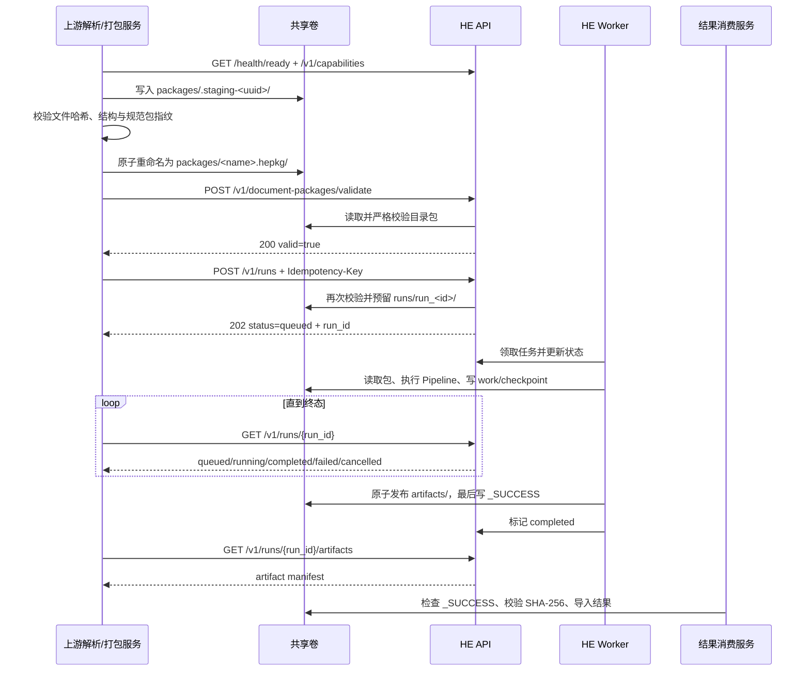
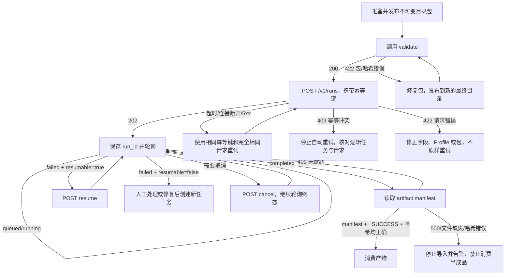

# HE 服务 API 对接指南

本文面向需要通过 HTTP API 调用 Hyper-Extract（下文简称 HE）课程知识图谱服务的上游解析服务、任务编排服务和结果消费服务。本文描述的是当前代码中的 **API v1 / Document Package 1.0–1.1 实际契约**。

当前服务采用“控制面走 HTTP、数据面走共享文件系统”的方式：调用方先把不可变的 Document Package 目录发布到共享卷，再把 `file://` URI 和包指纹提交给 HE。API 不接收原始文件、文件流、模型地址或模型密钥。

## 1. 对接前准备

### 1.1 双方需要提前确认的内容

| 项目 | 调用方需要准备 | HE 部署方需要准备 |
|---|---|---|
| API 地址 | 能访问 HE Base URL，例如 `http://he-api:8000` | 暴露 API 或配置网关、网络策略和 TLS |
| 共享存储 | 能向 `packages` 区域写目录包，并从 `runs` 区域读取结果 | API、Worker、调用方挂载同一存储，且容器内绝对路径一致 |
| 包生成器 | 能生成 Document Package v1、文件 SHA-256 和规范包指纹 | 提供 `/v1/contracts/document-package/v1` 契约发现接口 |
| Pipeline | 使用 `course_graph` + `course_knowledge_graph@1` | 部署对应 Pipeline |
| 模型 Profile | 请求中只传已约定的 Profile 名称 | 保证 API 与 Worker 能解析同一 Profile；默认名称为 `openai-compatible-default` |
| 幂等策略 | 为一次逻辑任务生成并持久化唯一 `Idempotency-Key` | 持久化幂等键与请求指纹 |
| 状态消费 | 保存 `run_id`，实现轮询、超时、取消和恢复 | 保持 API 与 Worker 正常运行 |
| 结果校验 | 读取 manifest、检查 `_SUCCESS`、校验每个文件 SHA-256 | 原子发布完整产物 |

!!! warning "共享路径必须一致"

    HE 在创建任务时把解析后的绝对包路径保存给 Worker。例如调用方提交 `file:///exchange/packages/course.hepkg/`，API 和 Worker 都必须在 `/exchange/packages/course.hepkg/` 看到同一目录。仅挂载同一份数据但使用不同容器内路径不满足当前契约。

### 1.2 鉴权与密钥边界

当前 HE 应用层 **没有内置身份认证或授权**。生产环境应通过 API Gateway、Service Mesh、mTLS 或受控内网限制访问。若网关增加了 `Authorization` 等请求头，以实际部署约定为准。

模型服务密钥由 HE 部署侧的 Model Profile 管理，调用方不得在任务请求中传递 OpenAI、Anthropic、Embedding 或其他模型密钥。API 与 Worker 读取同一份 Profile 定义文件（TOML 中只含模型地址与密钥环境变量名），但只有 Worker 解析密钥值：API 用 `public_descriptor()` 计算不含密钥的 Profile 指纹，因此 API 进程不需要任何模型密钥环境变量；Worker 通过 `resolve_runtime()` 解析命名的密钥变量并独占模型网络出口。

### 1.3 上线前最小验收清单

- `GET /health/live` 返回 `200`。
- `GET /health/ready` 返回 `200`。该端点依次执行六项检查并收集全部失败项，任一失败返回 `503` 且 `error.details` 列出失败的检查名：
    - `database`：`SELECT 1` 成功；
    - `migration`：`alembic_version` 等于迁移脚本 head（当前 `0002_service_recovery`）；
    - `package_root`：`/exchange/packages` 目录存在且可读；
    - `run_root`：在 `/exchange/runs` 创建、`fsync` 并删除探针文件成功；
    - `model_profiles`：配置的 Profile 文件可解析，默认 Profile 能产出公开描述符；
    - `worker`：存在心跳时间戳新于 `2 * heartbeat_seconds` 的 Worker。
  响应中绝不包含数据库 URL 或任何密钥值。仍建议用一个小包完成端到端冒烟测试。
- `GET /v1/capabilities` 包含 `course_graph`、Document Package `1.1` 和 `file`。
- 调用方写入的最终包目录能被 HE API 和 Worker 以同一个绝对路径读取。
- 一个最小包能通过 `POST /v1/document-packages/validate`。
- 约定的 `execution.model_profile` 已在 HE 部署中配置。
- 调用方能保存 `Idempotency-Key`、`run_id` 和包指纹，服务重启后不丢失。
- 调用方能读取 `output.artifacts_uri` 下的文件并计算 SHA-256。

## 2. 总体流程

### 2.1 正常路径



### 2.2 异常处理路径



## 3. `package_uri` 路径契约

### 3.1 当前支持范围

`package_uri` 当前只支持共享卷上的目录：

```text
file:///exchange/packages/<package-name>.hepkg/
```

路径约束如下：

| 约束 | 当前行为 |
|---|---|
| URI scheme | 必须为 `file` |
| authority / host | 只能为空或 `localhost` |
| 路径 | 必须已存在，解析后必须位于 `${HE_SERVICE_EXCHANGE_ROOT}/packages` 下 |
| 类型 | 必须是目录，不支持 ZIP、单文件或 HTTP 下载地址 |
| 符号链接 | 包目录及从包目录回溯到 `packages` 根之间不能包含符号链接 |
| staging | 解析后的任一路径段不能以 `.staging` 开头 |
| URL 编码 | 路径会做 percent-decoding；空格建议编码为 `%20` |
| 扩展名 | `.hepkg` 是推荐命名，不由代码强制 |
| 查询和片段 | 不属于契约；不要使用 `?query` 或 `#fragment` |

有效示例：

```text
file:///exchange/packages/course-20260714.hepkg/
file://localhost/exchange/packages/tenant-a/course.hepkg/
file:///exchange/packages/%E8%AF%BE%E7%A8%8B.hepkg/
```

无效示例：

```text
https://storage.example.com/course.hepkg       # scheme 不支持
s3://bucket/course.hepkg                       # scheme 不支持
file:///exchange/runs/run_123/                  # 不在 packages 根下
file:///exchange/packages/.staging-123/         # staging 目录
file:///exchange/packages/course.hepkg.zip      # 若为普通文件则拒绝
file://remote-host/exchange/packages/a.hepkg/   # authority 不支持
```

### 3.2 发布目录包

调用方必须采用“临时目录 + 原子重命名”发布，并把最终目录视为不可变对象：

1. 在同一文件系统内创建 `/exchange/packages/.staging-<uuid>/`。
2. 写完所有文件，关闭并刷盘。
3. 在 staging 目录内完成结构、字节数、文件哈希和规范包指纹校验。
4. 原子重命名为 `/exchange/packages/<stable-name>.hepkg/`。
5. 只把最终目录的 `file://` URI 提交给 HE。
6. 提交后不得覆盖、追加、删除或原地修改任何文件；新版本必须发布到新目录。

不可变性是 v1 数据面契约的一部分。API 在创建任务时验证包，但 Worker 可能稍后才读取它；在此期间修改目录会造成请求指纹与实际处理内容不一致。

## 4. Document Package v1 契约

### 4.1 目录结构

```text
course.hepkg/
├── manifest.json
├── extraction-brief.yaml
├── outline.json
├── provenance.jsonl
└── content/
    ├── chapter-01.md
    └── chapter-02.md
```

契约发现接口 `GET /v1/contracts/document-package/v1` 会返回必需条目和当前 JSON Schema。调用方应以接口返回的 Schema 作为机器可读契约，以本文作为语义说明。

所有 JSON/JSONL 和进入抽取的内容文件均应使用 UTF-8。内容文件通常为 Markdown，但当前清单中没有单独的 media type 字段；HE 会把 `extract=true` 的内容按 UTF-8 文本读取。

### 4.2 `manifest.json`

完整示例：

```json
{
  "schema_name": "HyperExtractDocumentPackage",
  "schema_version": "1.1",
  "document": {
    "id": "course-2026-001",
    "title": "示例课程",
    "language": "zh-CN",
    "source": {
      "path": "source/course.pdf",
      "sha256": "0123456789abcdef0123456789abcdef0123456789abcdef0123456789abcdef"
    }
  },
  "producer": {
    "name": "course-parser",
    "version": "2.3.1"
  },
  "outline_path": "outline.json",
  "provenance_path": "provenance.jsonl",
  "extraction_brief": {
    "path": "extraction-brief.yaml",
    "sha256": "<extraction-brief.yaml 原始字节的 SHA-256>",
    "bytes": 2048
  },
  "contents": [
    {
      "id": "content-chapter-01",
      "path": "content/chapter-01.md",
      "order": 0,
      "content_kind": "body",
      "outline_id": "chapter-01",
      "sha256": "<chapter-01.md 原始字节的 64 位小写十六进制 SHA-256>",
      "bytes": 12345,
      "extract": true
    }
  ]
}
```

顶层字段：

| 字段 | 类型 | 必填 | 约束与说明 |
|---|---|---:|---|
| `schema_name` | string | 是 | 固定 `HyperExtractDocumentPackage` |
| `schema_version` | string | 是 | `1.0` 兼容旧包；新任务使用 `1.1` |
| `document` | object | 是 | 文档身份与元数据 |
| `producer` | object | 是 | 包生成器身份 |
| `outline_path` | string | 是 | 包内安全相对文件路径，通常为 `outline.json` |
| `provenance_path` | string | 是 | 包内安全相对文件路径，通常为 `provenance.jsonl` |
| `extraction_brief` | object | v1.1 是 | 调用方运行级抽取意图；文件必须位于 Package 内 |
| `contents` | array | 是 | 声明的内容文件；生产任务至少应有一项 `extract=true` |

`extraction_brief` 字段：

| 字段 | 类型 | 必填 | 约束与说明 |
|---|---|---:|---|
| `path` | string | 是 | Package 内安全相对路径，扩展名必须为 `.yaml` 或 `.yml` |
| `sha256` | string | 是 | YAML 原始字节的 64 位小写 SHA-256 |
| `bytes` | integer | 是 | YAML 原始字节数，最大 256 KiB |

API 不单独接收 system prompt 或 Brief 路径。调用方必须先把 `HyperExtractExtractionBrief` YAML 放入 Package，再更新 manifest 和规范包指纹。这保证 API、Worker、断点和审计看到的是同一份不可漂移的抽取意图。

!!! note "文件 SHA-256 与 Brief content_hash 不同"

    `manifest.extraction_brief.sha256` 是 `extraction-brief.yaml` 原始字节的哈希，YAML 空格或换行变化也会改变它；validate 响应中的 `extraction_brief.content_hash` 是 YAML 解析、Schema 校验和默认值补齐后的规范 JSON 哈希，用于标识 Brief 的语义内容。两者都是 64 位小写十六进制，但不能互换。

`document` 字段：

| 字段 | 类型 | 必填 | 说明 |
|---|---|---:|---|
| `id` | string | 是 | 上游稳定文档 ID；当前未额外限制格式 |
| `title` | string | 是 | 文档标题 |
| `language` | string | 否 | 默认空字符串，建议使用 BCP 47 风格，如 `zh-CN`、`en` |
| `source` | object/null | 否 | 原始来源元数据；省略时规范化值为 `null` |
| `source.path` | string | `source` 存在时是 | 来源标识或路径，仅作元数据；当前不会据此读取包内文件 |
| `source.sha256` | string/null | 否 | 原始来源哈希；当前 Schema 未限制格式，建议使用 64 位小写 SHA-256 |

`producer` 字段：

| 字段 | 类型 | 必填 | 说明 |
|---|---|---:|---|
| `name` | string | 是 | 生成该包的服务/适配器名称 |
| `version` | string | 是 | 生成器版本，便于追踪兼容性 |

`contents[]` 字段：

| 字段 | 类型 | 必填 | 约束与说明 |
|---|---|---:|---|
| `id` | string | 是 | 包内唯一内容 ID |
| `path` | string | 是 | 包内唯一、安全、非绝对相对路径；不能包含 `..`，不能经过符号链接 |
| `order` | integer | 是 | `>= 0`，在包内唯一；控制处理顺序 |
| `content_kind` | enum | 是 | 见下表 |
| `outline_id` | string/null | 条件必填 | `extract=true` 时必须存在，且必须引用 `outline.json` 中的节点 |
| `sha256` | string | 是 | 文件原始字节的 SHA-256，必须是 64 位小写十六进制 |
| `bytes` | integer | 是 | 文件原始字节数，必须 `>= 0` 且与实际文件一致 |
| `extract` | boolean | 是 | 是否进入切块和模型抽取；无论取值如何，声明的文件都会校验 |

支持的 `content_kind`：

| 值 | 含义 |
|---|---|
| `body` | 正文 |
| `table_of_contents` | 目录页 |
| `appendix` | 附录 |
| `references` | 参考文献 |
| `index` | 索引 |
| `front_matter` | 前置内容 |
| `back_matter` | 后置内容 |
| `other` | 其他内容 |

### 4.3 `extraction-brief.yaml` 系统提示词契约

#### 4.3.1 定位与作用边界

`ExtractionBrief` 是调用方为本次抽取提供的运行级语义意图。它用于告诉 HE：为什么抽取、如何理解来源、关注什么、排除什么、采用什么术语，以及各模型阶段需要遵循哪些业务要求。

它不是以下内容：

- 不是原始正文或正文补充材料。
- 不是任意模型参数、模型地址或模型密钥。
- 不是 Extraction Profile 的替代品。
- 不是修改 Course Graph 输出 Schema 的扩展机制。
- 不是 API 请求中的临时 `system_prompt` 字符串。

新生产接入应使用 Document Package `1.1`，把 Brief 放在 Package 内并由 `manifest.extraction_brief` 声明。HE 的指令优先级为：

```text
HE 输出与证据硬约束
  > 服务端 Extraction Profile
  > 调用方 ExtractionBrief
  > Package metadata
  > 原始正文
```

正文只作为证据，不作为指令。Brief 可以收窄抽取范围、指定术语和关系偏好，但不能覆盖输出结构、证据规则，也不能要求模型编造来源中不存在的事实。

#### 4.3.2 完整 YAML 示例

```yaml
schema_name: HyperExtractExtractionBrief
schema_version: "1.0"

metadata:
  id: course-knowledge-v1
  version: "1.0"
  description: 面向课程知识导航的抽取意图

task:
  objective: 抽取有原文证据、可以独立理解和复用的课程知识点
  output_usage:
    - 课程知识导航
    - 学习路径生成
  target_audience:
    - 课程学习者
    - 教研人员

domain:
  name: 项目管理
  description: 采用来源文档自身的概念体系，不引入外部知识
  language: zh-CN

source:
  document_type: 课程讲义
  title: 项目管理基础
  role: 本次抽取的唯一事实来源
  authority: 课程官方教材
  interpretation: manifest 中的目录是原始章节结构，抽取结果应保留该层级

extraction_policy:
  granularity: 一个脱离当前段落后仍能独立解释的知识单元
  focus:
    - 有明确定义的概念
    - 方法、流程和规则
  exclusions:
    - 页眉页脚
    - 仅用于排版或导航的文字
  preserve_source_hierarchy: true
  evidence_required: true

relation_policy:
  priorities:
    - 明确的学习前置关系
    - 原文直接陈述的派生关系
  allowed:
    - prerequisite
    - derivative
    - related
    - confusable
  forbidden:
    - 仅因为出现在同一章节而建立 related
  require_evidence: true

terminology:
  canonical_names:
    Project Charter: 项目章程
  aliases:
    项目章程:
      - Project Charter
  naming_rules:
    - 优先使用来源中的正式术语
    - 不使用只在当前段落中有意义的代词作为名称

stage_instructions:
  node_extraction:
    - 条件、例外和适用范围应与对应知识点一起保留
  local_relation_extraction:
    - 只输出当前内容块中有明确证据的关系
  deduplication:
    - 缩写与全称可以合并，但相近概念不能仅凭主题相似而合并
  global_relation_extraction:
    - 跨章节关系必须有直接语义依据，禁止按章节邻近度猜测
  community:
    - 社区名称应使用课程中的正式主题名称
  evaluation:
    - 优先检查定义、适用条件和例外是否被保留

additional_instructions:
  - 输出名称使用简体中文

extensions:
  com.example.course:
    curriculum_code: PM-101
    edition: "2026"
```

YAML 顶层必须是 object。除 `extensions` 的内部载荷外，核心模型均拒绝未知字段。文件整体最大 256 KiB，使用 UTF-8；建议用空格缩进，不使用 YAML 自定义对象标签。

#### 4.3.3 顶层字段

| 字段 | 类型 | 必填 | 默认值 | 含义和作用 |
|---|---|---:|---|---|
| `schema_name` | string | 是 | 无 | 固定为 `HyperExtractExtractionBrief`，用于识别契约类型 |
| `schema_version` | string | 是 | 无 | 当前固定为 `1.0`；这是 Brief Schema 版本，不是 Package 或 API 版本 |
| `metadata` | object | 是 | 无 | Brief 身份、版本和说明；参与 Brief 指纹并进入所有已编译模型阶段 |
| `task` | object | 是 | 无 | 本次抽取目标、用途和受众；进入所有已编译模型阶段 |
| `domain` | object | 否 | 空对象默认值 | 领域背景；进入所有已编译模型阶段 |
| `source` | object | 否 | 空对象默认值 | 告诉模型如何理解来源；进入所有已编译模型阶段，不会改变文件读取方式 |
| `extraction_policy` | object | 否 | 见下文 | 节点/组合抽取的范围、颗粒度和证据偏好 |
| `relation_policy` | object | 否 | 见下文 | 局部/全局关系抽取的关系偏好和限制 |
| `terminology` | object | 否 | 空映射/列表 | 节点命名、关系抽取和去重使用的术语规范 |
| `stage_instructions` | object | 否 | 各阶段空列表 | 只投影给对应模型阶段的补充要求 |
| `additional_instructions` | string[] | 否 | `[]` | 通用补充要求；当前进入所有已编译模型阶段，最多 64 项 |
| `extensions` | object | 否 | `{}` | 业务自定义上下文；当前原样进入所有已编译模型阶段，HE 不解释其领域含义 |

#### 4.3.4 `metadata`、`task`、`domain` 和 `source`

| 路径 | 类型 | 必填 | 限制 | 实际作用 |
|---|---|---:|---|---|
| `metadata.id` | string | 是 | 最长 128；匹配 `^[a-z0-9][a-z0-9._-]*$` | 稳定标识一次意图模板；用于验证响应、checkpoint、摘要和 Prompt 内容 |
| `metadata.version` | string | 是 | 1–64 字符 | 调用方管理的 Brief 版本；不参与服务端功能分支，但参与内容与审计身份 |
| `metadata.description` | string | 否 | 默认 `""`，最长 2000 | 给模型和审计人员看的说明；进入所有已编译模型阶段 |
| `task.objective` | string | 是 | 1–4000 字符 | 本次抽取的核心目标；是最主要的调用方语义指令 |
| `task.output_usage` | string[] | 否 | 最多 32 项 | 说明结果将用于什么场景，帮助模型选择信息颗粒度；不会改变输出 Schema |
| `task.target_audience` | string[] | 否 | 最多 32 项 | 说明结果面向谁，帮助模型调整术语和可理解程度 |
| `domain.name` | string | 否 | 最长 256 | 领域名称，仅作为模型上下文 |
| `domain.description` | string | 否 | 最长 4000 | 领域边界和背景，仅作为模型上下文，不能当作来源事实 |
| `domain.language` | string | 否 | 最长 32 | 期望语言提示；当前不会触发独立语言处理器 |
| `source.document_type` | string | 否 | 最长 256 | 来源类型，例如教材、合同、手册 |
| `source.title` | string | 否 | 最长 1000 | 来源标题；不会覆盖 `manifest.document.title` |
| `source.role` | string | 否 | 最长 1000 | 来源在任务中的角色，例如“唯一事实来源” |
| `source.authority` | string | 否 | 最长 1000 | 来源权威性说明，仅供模型判断，不会被 HE 外部验证 |
| `source.interpretation` | string | 否 | 最长 4000 | 如何解释目录、章节或来源内容；不会修改 Package 解析逻辑 |

#### 4.3.5 `extraction_policy`

| 字段 | 类型 | 默认值/限制 | 作用阶段 | 含义 |
|---|---|---|---|---|
| `granularity` | string | `""`，最长 1000 | 节点、组合抽取 | 描述一个知识点应细到什么程度 |
| `focus` | string[] | `[]`，最多 64 项 | 节点、组合抽取 | 优先抽取的内容类型 |
| `exclusions` | string[] | `[]`，最多 64 项 | 节点、组合抽取 | 应忽略的噪声或业务上不需要的内容 |
| `preserve_source_hierarchy` | boolean | `true` | 节点、组合抽取 | 提示模型保留来源目录归属；实际父目录仍由 Pipeline 和输出 Schema 校验 |
| `evidence_required` | boolean | `true` | 节点、组合抽取 | 提示模型要求证据；设为 `false` 也不能放宽 HE/Profile 的更高优先级证据约束 |

#### 4.3.6 `relation_policy`

| 字段 | 类型 | 默认值/限制 | 作用阶段 | 含义 |
|---|---|---|---|---|
| `priorities` | string[] | `[]`，最多 64 项 | 组合、局部关系、全局关系 | 关系生成时优先考虑的关系或业务判断 |
| `allowed` | string[] | `[]`，最多 64 项 | 组合、局部关系、全局关系 | 调用方希望允许的关系；不能扩展 Course Graph 固定关系枚举 |
| `forbidden` | string[] | `[]`，最多 64 项 | 组合、局部关系、全局关系 | 应拒绝的关系或判断方式 |
| `require_evidence` | boolean | `true` | 组合、局部关系、全局关系 | 提示每条关系必须有证据；设为 `false` 也不能覆盖 HE/Profile 的证据要求 |

当前 Course Graph 的语义关系仍固定为 `prerequisite`、`derivative`、`related`、`confusable`。在 `allowed` 中填写新名称不会创建新的输出类型，只可能导致模型输出被 Schema 拒绝或修复。

#### 4.3.7 `terminology`

| 字段 | 类型 | 默认值/限制 | 作用阶段 | 含义 |
|---|---|---|---|---|
| `canonical_names` | map[string,string] | `{}`；最多 500 项 | 节点、组合、局部关系、去重、全局关系 | 将来源名称规范到期望名称 |
| `aliases` | map[string,string[]] | `{}`；最多 500 个词条，每个最多 32 个别名 | 同上 | 告诉模型哪些名称可能是同一术语的别名 |
| `naming_rules` | string[] | `[]`，最多 64 项 | 同上 | 命名、大小写、缩写或语言规则 |

术语映射主要通过 Prompt 影响模型。最终去重仍受服务端 Profile、相似度逻辑和输出校验控制，不应把它视为无条件的强制重命名表。

#### 4.3.8 `stage_instructions`

每个列表最多 64 项。当前阶段映射如下：

| YAML 字段 | 编译目标 | 当前 API 服务中是否实际调用 | 适合填写的内容 |
|---|---|---:|---|
| `node_extraction` | 节点抽取；组合抽取也会同时接收 | 是 | 节点范围、颗粒度、条件/例外保留方式 |
| `local_relation_extraction` | 局部关系；组合抽取也会同时接收 | 是 | 同一内容块内关系判断规则 |
| `deduplication` | 同义知识点去重 | 是 | 缩写、别名、易混概念的合并/拒绝规则 |
| `global_relation_extraction` | 跨章节候选关系 | 是 | 跨章节关系证据和优先级 |
| `community` | 社区摘要 | 当前通常否 | 社区命名与摘要规则；API Worker 当前配置 `community_reports=false` |
| `evaluation` | 评估阶段 | 否 | Schema 和渲染器已支持，但当前 Course API Pipeline 尚未连接该模型阶段 |

不要把必须全阶段生效的规则只写进某个 stage 字段；通用要求应写入 `task.objective` 或 `additional_instructions`。

#### 4.3.9 `extensions`

`extensions` 用于携带 HE 核心 Schema 不理解的业务上下文。顶层键推荐使用反向域名命名空间，例如 `com.example.course`。当前验证要求键中至少包含一个 `.` 且最长 128 字符。

扩展载荷限制：

- 只能包含 JSON 兼容的 object、array、string、number、boolean 或 `null`。
- object 每层最多 256 个键，键最长 128 字符。
- array 每层最多 256 项。
- 最多嵌套 8 层。
- 单个字符串最长 8000 字符。
- 仍受整个 YAML 256 KiB 上限约束。

当前实现把完整 `extensions` 传入所有已编译模型阶段，并不会根据扩展命名空间自动路由，也不会在核心代码中解释、校验或执行其业务含义。不要在其中放模型密钥、个人敏感信息或不应进入 Prompt/运行快照的数据。

#### 4.3.10 在不同处理环节中的作用

| 环节 | Brief 的作用 | 对接方可观察结果 |
|---|---|---|
| Package 生成 | 写入 YAML；在 manifest 声明原始字节 `sha256` 和 `bytes` | Package 1.1 具备完整抽取意图 |
| `POST /document-packages/validate` | 校验安全路径、扩展名、大小、字节数、文件哈希、YAML 和 Schema；不调用模型 | 响应返回 Brief `id`、`version`、规范 `content_hash` |
| `POST /v1/runs` | Brief 不作为独立请求字段；通过 Package 指纹参与请求与幂等身份 | 修改 Brief 后必须更新 Package 指纹；旧幂等键可能冲突 |
| Worker ingest | 再次读取、验证 Brief，并调用 `apply_extraction_brief` 重新编译各阶段 Prompt | 进度中出现 Brief ID、版本和 hash 前缀 |
| 模型执行 | HE 硬约束 + Profile + 当前阶段 Brief 投影形成 system message；正文/候选项放在 user message | Brief 只影响被当前 Pipeline 实际调用的模型阶段 |
| checkpoint/resume | Brief ID、版本、content hash 和最终 Prompt hash 进入 checkpoint 身份 | 修改 Brief 后不能静默复用旧 checkpoint |
| 运行审计 | 保存规范 JSON、YAML 快照和各阶段 Prompt 模板 | 位于 `runs/<run_id>/work/.he-run/`，不属于公开 artifact manifest |
| 成功结果 | `run-summary.json.extraction_brief` 记录 ID、版本、content hash | 消费方可核对最终结果采用的 Brief |

!!! warning "Brief 是模型指令，不是全部都是确定性业务规则"

    `focus`、`exclusions`、术语、关系策略和多数 stage instructions 通过 system message 引导模型；它们不会自动生成新的代码级过滤器。真正的硬约束仍由 Package Schema、Course Graph Schema、Extraction Profile 和质量门控制。若某条规则必须 100% 保证，应同时在服务端增加确定性校验，而不能只写 Prompt。

!!! warning "运行快照包含调用方指令"

    `.he-run/` 会保存 `extraction-brief.normalized.json`、`extraction-brief.snapshot.yaml` 和 `prompts/*.txt`。这些文件不会通过 `/artifacts` 公开，但能读取共享 `runs` 卷的主体可能看到它们。部署方需要限制共享卷权限，并制定日志、快照和失败任务的清理策略。

### 4.4 `outline.json`

```json
{
  "schema_name": "HyperExtractOutline",
  "schema_version": "1.0",
  "nodes": [
    {
      "id": "root",
      "title": "示例课程",
      "depth": 0,
      "parent_id": null,
      "order": 0,
      "source_refs": []
    },
    {
      "id": "chapter-01",
      "title": "第一章 基础概念",
      "depth": 1,
      "parent_id": "root",
      "order": 1,
      "source_refs": [
        {
          "ref": "source/course.md#L1-L80",
          "source_path": "source/course.md",
          "start_line": 1,
          "end_line": 80
        }
      ]
    }
  ]
}
```

| 字段 | 类型 | 必填 | 约束与说明 |
|---|---|---:|---|
| `schema_name` | string | 是 | 固定 `HyperExtractOutline` |
| `schema_version` | string | 是 | 固定 `1.0` |
| `nodes` | array | 是 | 不能为空 |
| `nodes[].id` | string | 是 | 全局唯一 |
| `nodes[].title` | string | 是 | 目录标题 |
| `nodes[].depth` | integer | 是 | `>= 0`；子节点必须等于父节点 `depth + 1` |
| `nodes[].parent_id` | string/null | 否 | 根节点为 `null`；其他节点引用已声明节点 |
| `nodes[].order` | integer | 是 | `>= 0` 且全局唯一 |
| `nodes[].source_refs` | array | 否 | 默认空数组 |

目录树必须恰好有一个根节点，根节点 `depth=0`，不能有孤儿节点或环。

### 4.5 `SourceReference`

`outline.json` 和 `provenance.jsonl` 共用来源引用结构：

| 字段 | 类型 | 必填 | 说明 |
|---|---|---:|---|
| `ref` | string | 是 | 人类可读的稳定引用，如 `book.md#L20-L42` 或页码引用 |
| `page_no` | integer/null | 否 | 页码；当前未限定从 0 还是 1 开始，接入双方应自行统一 |
| `bbox` | object/null | 否 | 坐标信息；当前不限定内部键，接入双方应约定坐标系 |
| `source_path` | string/null | 否 | 原始来源路径或标识 |
| `start_line` | integer/null | 否 | `>= 1` |
| `end_line` | integer/null | 否 | `>= 1` |
| `content_id` | string/null | 否 | 内容 ID |

若 `ref` 严格匹配 `<path>#L<start>-L<end>`，HE 在加载时可补齐缺失的 `source_path`、`start_line` 和 `end_line`；provenance 引用缺少 `content_id` 时也会用当前记录的 `content_id` 补齐。建议生产方仍显式填写这些字段。

### 4.6 `provenance.jsonl`

每个非空行是一个独立 JSON 对象：

```json
{"content_id":"content-chapter-01","source_refs":[{"ref":"source/course.md#L1-L80","source_path":"source/course.md","start_line":1,"end_line":80}]}
{"content_id":"content-chapter-02","source_refs":[{"ref":"source/course.md#L81-L160","source_path":"source/course.md","start_line":81,"end_line":160}]}
```

| 字段 | 类型 | 必填 | 约束 |
|---|---|---:|---|
| `content_id` | string | 是 | 每个内容 ID 恰好出现一次，不能重复 |
| `source_refs` | array | 是 | 可为空；元素格式见 `SourceReference` |

`provenance.jsonl` 中的 `content_id` 集合必须与 `manifest.contents[].id` 集合完全相等，包括 `extract=false` 的内容。

### 4.7 安全、完整性与容量限制

验证接口会在模型初始化前检查：

- JSON/JSONL 可读取且结构符合当前 Schema；大多数契约对象拒绝未知字段。
- `manifest.json`、outline、provenance 和所有声明内容均为普通文件。
- 包内路径不是绝对路径、不包含 `..`、不经过符号链接且不能逃逸包根。
- 内容 ID、内容路径、内容顺序、目录 ID、目录顺序和 provenance content ID 均不重复。
- 目录只有一个根、父节点存在、深度连续且无环。
- `extract=true` 的内容有 `outline_id`，所有 `outline_id` 均存在。
- 内容文件的实际字节数和 SHA-256 与 manifest 一致。
- v1.1 Brief 的路径、扩展名、256 KiB 上限、实际字节数、SHA-256、UTF-8、YAML 和 Schema 均有效。
- provenance 与 manifest 的 content ID 集合完全一致。

默认限制：

| 限制 | 默认值 | 当前计算方式 |
|---|---:|---|
| 内容条目数 | 10,000 | `manifest.contents` 的长度 |
| 单个内容文件 | 64 MiB | 每个声明内容文件的原始字节数 |
| Brief 文件 | 256 KiB | `manifest.extraction_brief.bytes` 和实际原始字节均受限 |
| 总大小 | 2 GiB | outline + provenance + Brief + 所有声明内容文件；当前不计 manifest |

未在 manifest 中声明的额外文件不会进入内容校验或抽取。生产方不应依赖该行为存放无关或敏感文件。

!!! important "验证通过不等于一定可执行"

    当前 `/validate` 只按字节校验内容文件，不会提前解码所有 `extract=true` 文件，也不会要求至少有一个可抽取内容。为避免任务进入 Worker 后在 `ingest` 阶段失败，生产方必须保证所有可抽取内容是合法 UTF-8，并且至少有一个 `extract=true` 的内容条目。

### 4.8 规范包指纹 `sha256`

API 请求中的 `sha256` 不是目录打包文件的哈希，也不是 `manifest.json` 原始文本的哈希。它是经过 Schema 验证和默认值补齐后的规范 JSON 指纹。

计算步骤：

1. 完整验证 Document Package。
2. 将 manifest 和 outline 转为规范模型 JSON 对象，包含默认值和显式 `null`。
3. 按 `manifest.contents[].order` 升序排列 provenance 记录。
4. 若 Package 声明 Brief，将 YAML 解析为 `ExtractionBrief`，补齐默认值并转为规范 JSON 对象。
5. 构造：

    ```json
    {
      "manifest": {"...": "规范化后的 manifest"},
      "outline": {"...": "规范化后的 outline"},
      "provenance": [{"...": "按内容顺序排列的 provenance"}],
      "extraction_brief": {"...": "v1.1 规范化后的 Brief"}
    }
    ```

6. JSON 序列化使用 UTF-8、保留非 ASCII 字符、对象键递归排序、分隔符为 `,` 和 `:`，不添加多余空白。
7. 对序列化后的 UTF-8 字节计算 SHA-256，输出 64 位小写十六进制。

Python 参考实现：

```python
from hyperextract.documents import document_package_fingerprint

package_sha256 = document_package_fingerprint(
    "/exchange/packages/course-20260714.hepkg"
)
print(package_sha256)
```

安装了本项目环境时也可执行：

```bash
uv run python -c \
  'from hyperextract.documents import document_package_fingerprint; print(document_package_fingerprint("/exchange/packages/course-20260714.hepkg"))'
```

非 Python 服务应优先根据 `GET /v1/contracts/document-package/v1` 返回的 Schema 完成默认值归一化，再实现相同的 canonical JSON 算法。最稳妥的联调方式是准备固定测试包，并核对调用方与 HE 计算出的指纹完全一致。

内容正文和 Brief 原始 YAML 没有直接放入 canonical JSON，但内容文件的 `sha256` / `bytes`、Brief 原始文件的 `sha256` / `bytes` 和规范化 Brief 都会进入 payload，因此任一内容或 Brief 语义变化都会改变规范包指纹。Document Package 1.0 未声明 Brief 时不包含 `extraction_brief` 键，以保持旧包指纹兼容。

## 5. API 通用约定

### 5.1 协议

- 示例 Base URL：`http://he-api:8000`。
- 业务接口版本前缀：`/v1`。
- 请求和响应使用 `application/json; charset=utf-8`。
- 时间较长的抽取采用异步任务；`POST /v1/runs` 返回 `202` 不代表处理完成。
- FastAPI 自动提供 `/openapi.json` 和 `/docs`；生产网关可能关闭或限制它们。
- 当前没有回调/Webhook、SSE 或 WebSocket，调用方必须轮询状态。

### 5.2 错误响应有两种格式

HE 业务错误：

```json
{
  "error": {
    "code": "DOCUMENT_PACKAGE_HASH_MISMATCH",
    "message": "Document Package fingerprint does not match the request",
    "details": []
  }
}
```

FastAPI/Pydantic 请求校验错误，例如缺少请求头、字段类型错误、枚举错误或多传字段：

```json
{
  "detail": [
    {
      "type": "missing",
      "loc": ["header", "Idempotency-Key"],
      "msg": "Field required",
      "input": null
    }
  ]
}
```

调用方错误解析器必须同时支持 `error` 和 `detail`。未被 HE 转换的内部异常可能返回通用 `500`，其 body 不属于稳定业务契约，不应依赖。

### 5.3 API 一览

| 方法 | 路径 | 成功码 | 用途 |
|---|---|---:|---|
| `GET` | `/health/live` | 200 | 进程存活检查 |
| `GET` | `/health/ready` | 200 | 基础就绪检查 |
| `GET` | `/v1/capabilities` | 200 | 能力发现 |
| `GET` | `/v1/contracts/document-package/v1` | 200 | 获取包契约与 JSON Schema |
| `POST` | `/v1/document-packages/validate` | 200 | 提交任务前验证包和指纹 |
| `POST` | `/v1/runs` | 202 | 创建或幂等获取任务 |
| `GET` | `/v1/runs/{run_id}` | 200 | 查询任务 |
| `POST` | `/v1/runs/{run_id}/cancel` | 200 | 请求取消 |
| `POST` | `/v1/runs/{run_id}/resume` | 202 | 恢复可恢复失败任务 |
| `GET` | `/v1/runs/{run_id}/artifacts` | 200 | 获取成功任务的产物清单 |

## 6. API 详细说明

### 6.1 `GET /health/live`

表示 API 进程可以响应请求。

```json
{"status":"ok"}
```

此接口不检查数据库、Worker、共享卷内容或模型服务。

### 6.2 `GET /health/ready`

成功响应：

```json
{
  "status": "ready",
  "checks": {
    "package_root_readable": true,
    "run_root_writable": true,
    "repository": true
  }
}
```

当前实现主要检查 `packages` 和 `runs` 目录是否存在；`repository` 目前是静态 `true`，`run_root_writable` 也不是一次真实写入测试。因此它适合作为基础探针，不能替代端到端冒烟测试。检查失败返回：

```json
{
  "error": {
    "code": "SERVICE_NOT_READY",
    "message": "Service checks failed",
    "details": []
  }
}
```

HTTP 状态码为 `503`。

### 6.3 `GET /v1/capabilities`

当前响应：

```json
{
  "pipelines": ["course_graph"],
  "document_package_versions": ["1.0", "1.1"],
  "package_schemes": ["file"],
  "lifecycle": ["create", "status", "cancel", "resume", "artifacts"]
}
```

调用方可在启动或定期健康检查时验证所需能力。当前响应不列出可用的 Model Profile 名称；该名称需由部署双方另行约定。

### 6.4 `GET /v1/contracts/document-package/v1`

响应结构：

```json
{
  "schema_name": "HyperExtractDocumentPackage",
  "schema_version": "1.1",
  "supported_versions": ["1.0", "1.1"],
  "required_entries": [
    {"path":"manifest.json","kind":"file"},
    {"path":"outline.json","kind":"file"},
    {"path":"provenance.jsonl","kind":"file"},
    {"path":"content/","kind":"directory"}
  ],
  "version_requirements": {
    "1.0": {"extraction_brief":"not_required"},
    "1.1": {
      "extraction_brief":"required",
      "location":"manifest.extraction_brief.path",
      "formats":["yaml","yml"]
    }
  },
  "schemas": {
    "manifest": {"...":"JSON Schema"},
    "outline": {"...":"JSON Schema"},
    "provenance": {"...":"JSON Schema"},
    "extraction_brief": {"...":"JSON Schema"}
  }
}
```

建议缓存时同时保存 `schema_version`；发现不支持的版本时应停止生产新包并告警，不要自动猜测兼容性。

### 6.5 `POST /v1/document-packages/validate`

在排队前验证目录包、所有声明文件及规范包指纹。此接口只读，不创建任务。

请求：

```json
{
  "contract_version": "1.1",
  "package_uri": "file:///exchange/packages/course-20260714.hepkg/",
  "sha256": "<64 位小写十六进制规范包指纹>"
}
```

| 字段 | 类型 | 必填 | 约束 |
|---|---|---:|---|
| `contract_version` | string | 是 | `1.0` 或 `1.1`，须与 `manifest.schema_version` 一致 |
| `package_uri` | string | 是 | 见 `package_uri` 契约 |
| `sha256` | string | 是 | `^[0-9a-f]{64}$` |

成功响应 `200`：

```json
{
  "valid": true,
  "sha256": "9a03...64-hex...f21b",
  "document_id": "course-2026-001",
  "schema_version": "1.1",
  "content_count": 12,
  "extraction_brief": {
    "id": "course-knowledge-v1",
    "version": "1.0",
    "content_hash": "<规范化 Brief 指纹>"
  }
}
```

业务错误：

| HTTP | `error.code` | 含义 | 处理 |
|---:|---|---|---|
| 422 | `DOCUMENT_PACKAGE_INVALID` | URI、路径、结构、Schema、文件或内容完整性错误 | 修复后发布到新的最终目录，再验证 |
| 422 | `DOCUMENT_PACKAGE_VERSION_MISMATCH` | `contract_version` 与 `manifest.schema_version` 不一致 | 用与包一致的版本号重新请求 |
| 422 | `DOCUMENT_PACKAGE_LAYOUT_INVALID` | 包未采用标准服务布局（`outline.json`/`provenance.jsonl`/`content/`，v1.1 缺少 `extraction-brief.yaml`） | 按标准布局重新发布包 |
| 422 | `DOCUMENT_PACKAGE_HASH_MISMATCH` | 服务端计算的规范包指纹与请求不一致 | 核对 canonical 算法和包是否被修改 |

Brief 路径、扩展名、大小、文件哈希、YAML 或字段 Schema 错误均归入 `DOCUMENT_PACKAGE_INVALID`，当前没有单独的 `EXTRACTION_BRIEF_INVALID` 错误码。Document Package 1.0 的成功响应中 `extraction_brief` 为 `null`。

### 6.6 `POST /v1/runs`

创建异步任务。必须带请求头：

```http
Idempotency-Key: course-2026-001:package-v3
Content-Type: application/json
```

`Idempotency-Key` 长度为 1–255 个字符。建议使用调用方稳定任务 ID + 输入版本，不要使用每次 HTTP 重试都会变化的随机值。

该接口不接受 `system_prompt`、`prompt`、`extraction_brief` 或外部 `brief_uri` 字段；请求模型禁止未知字段。系统提示词只能通过 `input.package_uri` 指向的 Package 内 Brief 提供。

完整请求：

```json
{
  "input": {
    "type": "document_package",
    "contract_version": "1.1",
    "package_uri": "file:///exchange/packages/course-20260714.hepkg/",
    "package_format": "directory",
    "sha256": "<64 位小写十六进制规范包指纹>"
  },
  "pipeline": {
    "name": "course_graph",
    "profile": {
      "name": "course_knowledge_graph",
      "version": "1"
    }
  },
  "execution": {
    "model_profile": "openai-compatible-default",
    "context_policy": "auto",
    "priority": "normal",
    "budget": {
      "max_model_calls": 200,
      "max_input_tokens": 1000000
    }
  },
  "client_context": {
    "service": "course-platform",
    "task_id": "task-789",
    "course_id": "course-2026-001"
  }
}
```

请求字段：

| 路径 | 类型 | 必填 | 默认值/约束 |
|---|---|---:|---|
| `input.type` | string | 是 | 固定 `document_package` |
| `input.contract_version` | string | 是 | `1.0` 或 `1.1`，须与 Package `schema_version` 一致 |
| `input.package_uri` | string | 是 | `file://` 目录 URI |
| `input.package_format` | string | 是 | 固定 `directory` |
| `input.sha256` | string | 是 | 64 位小写十六进制规范包指纹 |
| `pipeline.name` | string | 是 | 固定 `course_graph` |
| `pipeline.profile.name` | string | 是 | 固定 `course_knowledge_graph` |
| `pipeline.profile.version` | string | 是 | 固定 `1` |
| `execution` | object | 否 | 整体可省略 |
| `execution.model_profile` | string | 否 | 默认 `openai-compatible-default`；必须是服务端可用 Profile |
| `execution.context_policy` | enum | 否 | `auto`（默认）、`preserve`、`repack` |
| `execution.priority` | enum | 否 | `normal`（默认）或 `low` |
| `execution.budget.max_model_calls` | integer/null | 否 | `>=1` |
| `execution.budget.max_input_tokens` | integer/null | 否 | `>=1` |
| `client_context` | object | 否 | 整体可省略；用于调用方关联，不影响 Pipeline 选择 |
| `client_context.service` | string/null | 否 | 最长 128 字符 |
| `client_context.task_id` | string/null | 否 | 最长 128 字符 |
| `client_context.course_id` | string/null | 否 | 最长 128 字符 |

修改 Brief 后，调用方必须重新计算 Brief 文件 SHA-256、更新 manifest、重新计算规范包指纹、发布到新的不可变 Package 路径，并在创建新逻辑任务时使用新的 `Idempotency-Key`。使用旧幂等键提交新 Brief 会返回 `409 IDEMPOTENCY_KEY_CONFLICT`。

!!! note "当前字段的执行效果"

    请求 Schema 已接受 `context_policy`、`priority` 和 `budget`，它们会进入请求与幂等指纹；但当前 `CourseRunExecutor` 尚未使用这些值改变调度、上下文策略或预算中止行为。调用方不应把它们当作当前版本已经生效的 SLA/限额保证。

成功响应 `202`：

```json
{
  "run_id": "run_7c73af29b37f40c59f2eea2dfef3d6ad",
  "status": "queued",
  "stage": "queued",
  "stage_status": "waiting",
  "attempt": 1,
  "progress": {},
  "error_summary": null,
  "resumable": false,
  "cancel_requested": false,
  "output": {
    "run_uri": "file:///exchange/runs/run_7c73af29b37f40c59f2eea2dfef3d6ad/",
    "artifacts_uri": "file:///exchange/runs/run_7c73af29b37f40c59f2eea2dfef3d6ad/artifacts/",
    "manifest_uri": "file:///exchange/runs/run_7c73af29b37f40c59f2eea2dfef3d6ad/artifacts/artifact-manifest.json",
    "success_marker_uri": "file:///exchange/runs/run_7c73af29b37f40c59f2eea2dfef3d6ad/artifacts/_SUCCESS"
  },
  "links": {
    "self": "/v1/runs/run_7c73af29b37f40c59f2eea2dfef3d6ad",
    "cancel": "/v1/runs/run_7c73af29b37f40c59f2eea2dfef3d6ad/cancel",
    "resume": "/v1/runs/run_7c73af29b37f40c59f2eea2dfef3d6ad/resume",
    "errors": "/v1/runs/run_7c73af29b37f40c59f2eea2dfef3d6ad/errors",
    "artifacts": "/v1/runs/run_7c73af29b37f40c59f2eea2dfef3d6ad/artifacts"
  }
}
```

相同 `Idempotency-Key` + 相同有效请求会返回同一个 `run_id`，响应仍为 `202`。幂等比较还包含服务端解析后的包路径、实际包指纹和 Model Profile 指纹；若同名 Model Profile 配置已变化，同一个幂等键也可能发生冲突。

业务错误：

| HTTP | `error.code` | 含义 |
|---:|---|---|
| 409 | `IDEMPOTENCY_KEY_CONFLICT` | 同一幂等键已用于不同请求或解析配置 |
| 422 | `DOCUMENT_PACKAGE_INVALID` | 包 URI 或包内容无效 |
| 422 | `DOCUMENT_PACKAGE_HASH_MISMATCH` | 包规范指纹不匹配 |
| 422 | `MODEL_PROFILE_INVALID` | 服务端不存在该 Profile，或 Profile 配置/环境变量不可用 |

### 6.7 `GET /v1/runs/{run_id}`

返回与创建接口相同的公共任务对象。`run_id` 不存在时返回：

```json
{
  "error": {
    "code": "RUN_NOT_FOUND",
    "message": "Run was not found",
    "details": []
  }
}
```

HTTP 状态码为 `404`。

运行中的 `progress` 是最近一次事件快照，不是完整事件历史：

```json
{
  "status": "progress",
  "message": "chunk-0003：12 节点 / 8 局部关系",
  "current": 3,
  "total": 20,
  "chunk_id": "chunk-0003",
  "details": {}
}
```

客户端应把 `status` 作为任务生命周期主状态，把 `stage`、`stage_status` 和 `progress` 用于展示与诊断。

任务状态：

| `status` | 是否终态 | 含义 |
|---|---:|---|
| `queued` | 否 | 已持久化，等待 Worker；恢复后也会回到 queued |
| `running` | 否 | Worker 正在处理 |
| `completed` | 是 | 产物已发布，可获取 artifact manifest |
| `failed` | 是 | 本次尝试失败；根据 `resumable` 决定是否可恢复 |
| `cancelled` | 是 | 排队任务立即取消；running 任务在安全检查点协作停止后由 Worker 收口为 `cancelled` |

常见阶段按当前 Pipeline 顺序为：

```text
queued -> ingest -> chunk_plan -> local_extract -> deduplicate
       -> global_edges -> quality -> communities -> finalize -> completed
```

调用方应允许未来增加阶段，不要把阶段当作封闭枚举。`attempt` 初始为 `1`，每次成功接受恢复请求加 `1`。

失败示例：

```json
{
  "run_id": "run_...",
  "status": "failed",
  "stage": "local_extract",
  "stage_status": "failed",
  "attempt": 1,
  "progress": {"status":"failed","message":"..."},
  "error_summary": {
    "code": "RUN_EXECUTION_FAILED",
    "message": "RuntimeError: upstream model timeout"
  },
  "resumable": true,
  "cancel_requested": false,
  "output": {"...":"同上"},
  "links": {"...":"同上"}
}
```

### 6.8 `POST /v1/runs/{run_id}/cancel`

无请求 body。取消是状态请求，不应通过关闭客户端连接实现。

- `queued`：立即转换为 `cancelled`。
- `running`：设置 `cancel_requested=true`，Pipeline 在安全检查点协作停止；Worker 捕获取消后通过 `mark_cancelled()` 把任务收口为 `cancelled`。成功响应不等于已到终态，必须继续轮询。
- 其他状态：返回 `409 RUN_NOT_CANCELLABLE`。
- 不存在：返回 `404 RUN_NOT_FOUND`。

成功响应 `200` 为完整任务对象。

### 6.9 `POST /v1/runs/{run_id}/resume`

无请求 body。仅当 `status=failed` 且 `resumable=true` 时接受。

成功响应 `202`：

- `status` 变为 `queued`；
- `stage_status` 变为 `recovering`；
- `attempt` 加一；
- 自动 Worker 租约恢复计数重置为 `0`，新 attempt 获得一组新的有界恢复预算；
- `error_summary` 清空；
- 使用同一个 `run_id` 和已有 checkpoint，已完成块不会重复处理。

不满足条件时返回 `409 RUN_NOT_RESUMABLE`；不存在时返回 `404 RUN_NOT_FOUND`。

### 6.10 `GET /v1/runs/{run_id}/artifacts`

仅 `status=completed` 时返回 artifact manifest。未完成返回 `409 ARTIFACTS_NOT_READY`；任务已完成但 manifest 丢失时返回 `500 ARTIFACT_STATE_INCONSISTENT`；不存在时返回 `404 RUN_NOT_FOUND`。

成功响应示例：

```json
{
  "schema_version": "1.0",
  "run_id": "run_7c73af29b37f40c59f2eea2dfef3d6ad",
  "status": "completed",
  "artifacts": [
    {
      "name": "course_graph",
      "path": "course-graph.json",
      "media_type": "application/json",
      "schema_name": "HyperExtractCourseGraph",
      "size": 48210,
      "sha256": "<文件 SHA-256>",
      "required": true
    }
  ]
}
```

`path` 相对于 `output.artifacts_uri`。调用方应拒绝绝对路径或包含 `..` 的异常 manifest 条目，即使服务端正常情况下不会生成它们。

### 6.11 `GET /v1/runs/{run_id}/errors`

返回该任务的失败历史，按发生顺序排列。仅暴露稳定字段，绝不包含异常 repr、请求头、供应商响应体、密钥或完整 Prompt 内容——这些只持久化在 `diagnostics/attempts/` 下供运维取证。任务不存在时返回 `404 RUN_NOT_FOUND`。

成功响应 `200`：

```json
{
  "run_id": "run_7c73af29b37f40c59f2eea2dfef3d6ad",
  "errors": [
    {
      "attempt": 1,
      "code": "MODEL_RATE_LIMIT_EXHAUSTED",
      "source": "worker",
      "message": "Provider request failed after retries",
      "occurred_at": "2026-07-14T10:00:00Z"
    }
  ]
}
```

`code` 取自稳定失败归一化（鉴权/非法输入不可恢复，瞬态/重试耗尽/Worker 恢复耗尽可恢复）；`message` 已脱敏并截断至 500 字符。调用方应优先用 `code` 驱动重试与告警策略，`message` 仅供人读。

## 7. 产物契约与消费顺序

### 7.1 发布完成判定

Worker 先在临时目录准备产物，再原子移动为 `artifacts/`，最后写 `_SUCCESS`，之后才把数据库任务标记为 `completed`。

消费方应按以下顺序处理：

1. 确认任务 API 返回 `status=completed`。
2. 调用 `/artifacts` 获取 manifest。
3. 确认 `output.success_marker_uri` 存在并可解析。
4. 确认 manifest 的 `run_id` 与任务一致、`status=completed`。
5. 对每个 `required=true` 条目确认文件存在、`size` 和 SHA-256 一致。
6. 校验业务 JSON 的 `schema_name` / `schema_version`。
7. 在消费方完成校验后再原子提交导入结果。

`_SUCCESS` 示例：

```json
{
  "completed_at": "2026-07-14T08:30:00.000000+00:00",
  "manifest": "artifact-manifest.json",
  "manifest_sha256": "<artifact-manifest.json 的 SHA-256>",
  "run_id": "run_7c73af29b37f40c59f2eea2dfef3d6ad"
}
```

### 7.2 产物列表

必需产物：

| 文件 | manifest `name` | `schema_name` | 用途 |
|---|---|---|---|
| `course-graph.json` | `course_graph` | `HyperExtractCourseGraph` | 课程知识图谱主结果 |
| `run-summary.json` | `run_summary` | `HyperExtractRunSummary` | 运行摘要；当前文件内容未强制包含该 schema_name |
| `quality-report.json` | `quality_report` | `HyperExtractQualityReport` | 覆盖率、悬空边等质量指标；当前文件内容未强制包含该 schema_name |
| `performance-report.json` | `performance_report` | `HyperExtractPerformanceReport` | 墙钟时间、调用、Token 与关系候选统计 |
| `cost-report.json` | `cost_report` | `HyperExtractCostReport` | Token 成本估算或未计价状态 |

可选产物：

| 文件 | manifest `name` | `schema_name` |
|---|---|---|
| `model-usage.json` | `model_usage` | `HyperExtractModelUsage` |
| `course-evaluation.json` | `course_evaluation` | `HyperExtractEvaluation` |
| `comparison-report.json` | `comparison_report` | `HyperExtractCourseGraphComparison` |

调用方只能把 manifest 中实际声明的可选文件视为存在，不能按文件名猜测。

### 7.3 `course-graph.json` v1

顶层结构：

```json
{
  "schema_name": "HyperExtractCourseGraph",
  "schema_version": "1.0",
  "run_id": "run_...",
  "profile_version": "1",
  "outline_nodes": [],
  "knowledge_nodes": [],
  "structural_edges": [],
  "semantic_edges": []
}
```

目录节点 `outline_nodes[]`：

| 字段 | 类型/取值 |
|---|---|
| `id` | 唯一字符串；不能与知识节点 ID 重复 |
| `name` | 目录标题 |
| `node_type` | `book`、`part`、`chapter`、`section`、`subsection` |
| `depth` | `>=0` |
| `parent_id` | 父目录节点 ID 或 `null` |
| `order` | `>=0` |
| `source_refs` | 来源引用数组 |

知识节点 `knowledge_nodes[]`：

| 字段 | 类型/取值 |
|---|---|
| `id` | 唯一字符串 |
| `name` | 知识点名称 |
| `level` | `point` 或 `sub_point` |
| `parent_outline_id` | 必须引用目录节点 |
| `summary` | 非空摘要 |
| `evidence` | 非空证据文本 |
| `source_refs` | 至少一个来源引用 |
| `profile_version` | 必须与图顶层一致 |
| `run_id` | 必须与图顶层一致 |
| `knowledge_kind` | string 或 `null` |
| `parent_knowledge_id` | 父知识点 ID 或 `null` |
| `aliases` | 字符串数组，默认空 |
| `learning_objective` | string 或 `null` |
| `confidence` | `0.0`–`1.0`，默认 `0.7` |

结构边 `structural_edges[]`：

| 字段 | 类型/取值 |
|---|---|
| `source_id` / `target_id` | 必须引用已存在节点，不能相同 |
| `edge_type` | `contains` 或 `describes` |
| `system_generated` | 必须为 `true` |

语义边 `semantic_edges[]`：

| 字段 | 类型/取值 |
|---|---|
| `source_id` / `target_id` | 必须引用知识节点，不能相同 |
| `edge_type` | `prerequisite`、`derivative`、`related`、`confusable` |
| `evidence` | 非空证据文本 |
| `source_refs` | 至少一个来源引用 |
| `confidence` | `0.0`–`1.0`，默认 `0.7` |
| `status` | `pending`、`approved`、`rejected`，默认 `pending` |

### 7.4 报告的关键字段

- `run-summary.json`：`run_id`、`status`、输入输出路径、目录/块/节点/边/社区数量、Profile 指纹、`extraction_brief` 的 ID/版本/content hash、质量摘要、模型用量和耗时。旧包没有 Brief 时该字段为 `null`。
- `quality-report.json`：目录覆盖数、覆盖率、未覆盖 section ID、知识点数、关系数、关系类型分布、悬空边和 `passed`。
- `performance-report.json`：`wall_elapsed_seconds`、`model_elapsed_seconds`、`chunks`、`max_workers`、`resumed`、请求统计、Token 统计、全局关系候选和接受率。
- `cost-report.json`：`status=estimated|partially_priced|unpriced`、币种、生成与 Embedding Token、各自每百万 Token 单价和估算金额。生成与 Embedding 独立计价；未配置的 Token 类别不会套用另一模型的价格，全部未配置时金额为 `null`。HE 不猜测供应商价格。
- `model-usage.json`：累计模型调用成功/失败/修复次数、Token、耗时，以及按 operation/mode 聚合的统计。

## 8. 重试、超时与异常处理建议

| 场景 | 是否自动重试 | 正确做法 |
|---|---:|---|
| 创建请求连接失败、超时、响应丢失 | 是 | 使用同一 `Idempotency-Key` 和完全相同 body 重试 |
| 创建返回 5xx | 是 | 指数退避 + jitter；仍复用原幂等键和 body |
| 查询/取消/恢复返回暂时性 5xx | 是 | 指数退避；操作本身保持同一个 `run_id` |
| 422 `detail` | 否 | 修正缺失字段、类型、枚举、未知字段或请求头 |
| 422 `DOCUMENT_PACKAGE_INVALID` | 否 | 修复并发布新包，不要原地修改已发布目录 |
| 422 `DOCUMENT_PACKAGE_HASH_MISMATCH` | 否 | 核对包不可变性和 canonical 指纹算法 |
| 422 `MODEL_PROFILE_INVALID` | 否 | 联系 HE 部署方修复或使用已约定 Profile |
| 409 `IDEMPOTENCY_KEY_CONFLICT` | 否 | 核对逻辑任务；若确实是新任务，使用新幂等键 |
| 404 `RUN_NOT_FOUND` | 通常否 | 检查环境和 `run_id`；不能用相同 ID 重建 |
| 409 `ARTIFACTS_NOT_READY` | 是 | 回到状态轮询，不直接读共享目录半成品 |
| `failed` 且 `resumable=true` | 有条件 | 按策略调用一次 resume，再观察；限制自动恢复次数 |
| `failed` 且 `resumable=false` | 否 | 人工处理或修复输入后创建新任务 |
| 产物哈希不一致或 `_SUCCESS` 缺失 | 否 | 禁止导入，保留现场并告警 |

建议轮询从 1–2 秒开始，逐步退避到 10–30 秒并加入 jitter；达到业务 SLA 后可请求取消，但仍需轮询终态。API 没有服务端 `Retry-After` 或任务超时字段，调用方应自行配置总等待时间、恢复次数和人工告警策略。

## 9. 端到端调用示例

```bash
HE_BASE_URL=http://he-api:8000
PACKAGE_PATH=/exchange/packages/course-20260714.hepkg
PACKAGE_URI=file:///exchange/packages/course-20260714.hepkg/

PACKAGE_SHA256="$(uv run python -c \
  'from hyperextract.documents import document_package_fingerprint; import sys; print(document_package_fingerprint(sys.argv[1]))' \
  "$PACKAGE_PATH")"

curl --fail-with-body "$HE_BASE_URL/health/ready"
curl --fail-with-body "$HE_BASE_URL/v1/capabilities"

curl --fail-with-body \
  -X POST "$HE_BASE_URL/v1/document-packages/validate" \
  -H 'Content-Type: application/json' \
  -d "{\"contract_version\":\"1.1\",\"package_uri\":\"$PACKAGE_URI\",\"sha256\":\"$PACKAGE_SHA256\"}"

curl --fail-with-body \
  -X POST "$HE_BASE_URL/v1/runs" \
  -H 'Content-Type: application/json' \
  -H 'Idempotency-Key: course-2026-001:package-v3' \
  -d "{
    \"input\":{
      \"type\":\"document_package\",
      \"contract_version\":\"1.1\",
      \"package_uri\":\"$PACKAGE_URI\",
      \"package_format\":\"directory\",
      \"sha256\":\"$PACKAGE_SHA256\"
    },
    \"pipeline\":{
      \"name\":\"course_graph\",
      \"profile\":{\"name\":\"course_knowledge_graph\",\"version\":\"1\"}
    },
    \"execution\":{\"model_profile\":\"openai-compatible-default\"},
    \"client_context\":{
      \"service\":\"course-platform\",
      \"task_id\":\"task-789\",
      \"course_id\":\"course-2026-001\"
    }
  }"
```

从创建响应保存 `run_id`，不要靠扫描 `runs` 目录发现任务：

```bash
RUN_ID=run_7c73af29b37f40c59f2eea2dfef3d6ad

curl --fail-with-body "$HE_BASE_URL/v1/runs/$RUN_ID"
curl --fail-with-body "$HE_BASE_URL/v1/runs/$RUN_ID/artifacts"
```

## 10. 当前 v1 边界与兼容性

- 仅支持共享文件系统 `file://` 目录包；不支持 multipart 上传、HTTP(S) 输入、S3/OSS URI 或 ZIP 包。
- 仅支持 `course_graph` Pipeline 和 `course_knowledge_graph@1` Profile。
- API 无内置鉴权；生产部署必须在外层建立安全边界。
- 任务进度仅支持轮询，暂无回调、事件流、任务列表和分页接口。
- 任务 API 不提供删除、重跑为新 `run_id`、服务端 SLA 或产物保留期查询。
- Model Profile 名称由部署双方约定，能力接口当前不返回 Profile 列表。
- 已发布包必须由调用方保证不可变；当前没有文件锁或对象版本 ID。
- Document Package 1.1 强制声明 Brief；1.0 仍可不带 Brief 并沿用旧的单消息 Prompt。底层验证器也允许 1.0 包声明可选 Brief，但新生产接入不应依赖该过渡行为。
- 任务创建/验证请求的 `contract_version` 接受 `1.0` 与 `1.1`，且必须与 `manifest.schema_version` 一致；声明版本与包实际版本不符会返回 `DOCUMENT_PACKAGE_VERSION_MISMATCH`，非标准布局返回 `DOCUMENT_PACKAGE_LAYOUT_INVALID`。
- Brief 的 `evaluation` 指令当前未接入 Course API Pipeline；API Worker 设置 `community_reports=false`，所以 `community` 指令通常也不会触发模型调用。
- `additional_instructions` 和完整 `extensions` 当前进入所有已编译模型阶段；不要在其中存放模型密钥或敏感数据。
- Brief 和编译后的 Prompt 会保存在 `runs/<run_id>/work/.he-run/`，不进入公开 artifact manifest，但需要通过共享卷权限和清理策略保护。
- `context_policy`、`priority` 和 `budget` 当前已进入请求契约，但尚未实际控制执行器。
- 契约发现响应把 `outline.json`、`provenance.jsonl` 和 `content/` 列为固定必需条目，服务端 `validate_service_package_layout` 会强制该标准布局（v1.1 还要求 `extraction-brief.yaml`）；外部 v1 生产方应遵守固定标准布局。
- 消费方应按 `schema_version` 做兼容分支，忽略响应中新出现的非关键字段，但不能忽略未知枚举值或缺失的必需字段。
- 新的不兼容数据契约应发布新 `contract_version` / `schema_version`，而不是静默改变 v1 含义。
